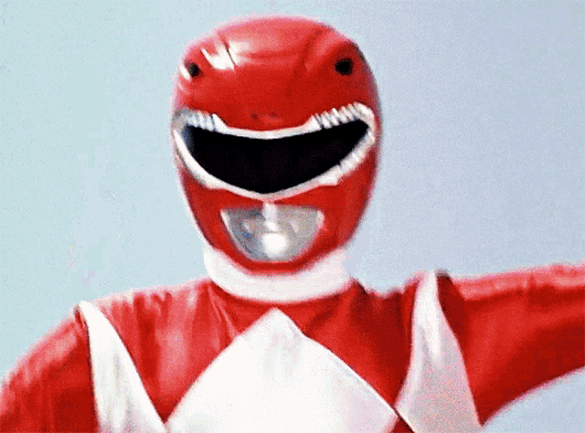

# 📐 Calculadora de Formas Geométricas

Projeto final de front-end: uma calculadora visual que desenha e calcula área e perímetro de figuras geométricas em tempo real.

## 🚀 Funcionalidades

- Seleção de figuras: `Quadrado`, `Retângulo`, `Triângulo`, `Círculo`
- Inputs dinâmicos para largura, altura, rotação e escala
- Cálculo automático de **área** e **perímetro**
- Desenho da figura no canvas com transformações visuais
- Interface responsiva e estilizada com CSS moderno

## 🧠 Tecnologias Utilizadas

- HTML5
- CSS3
- JavaScript (DOM, Canvas API)

## 📁 Estrutura de Arquivos

```bash
    src/ 
    ├── css/ 
    │ └── style.css 
    ├── js/ 
    │ ├── calculoDasAreas.js 
    │ └── desenharFigura.js 
    index.html
```

## 🖼️ Como funciona

1. O usuário escolhe uma figura geométrica.
2. Insere os valores de largura e altura (ou diâmetro, no caso do círculo).
3. Pode ajustar rotação e escala com sliders.
4. Ao clicar em **Calcular** ou mexer nos sliders, a figura é desenhada no canvas e os valores são exibidos.

## 📊 Fórmulas Utilizadas

```bash
| Figura     | Área                          | Perímetro                                   |
|------------|-------------------------------|---------------------------------------------|
| Quadrado   | \( A = L^2 \)                 | \( P = 4L \)                                |
| Retângulo  | \( A = L \times H \)          | \( P = 2(L + H) \)                          |
| Triângulo  | \( A = \frac{L \times H}{2} \)| \( P = L + H + \sqrt{L^2 + H^2} \) (aprox.) |
| Círculo    | \( A = \pi r^2 \)             | \( P = 2\pi r \)                            |
```

Obs: Para o círculo, o valor de "largura" representa o diâmetro.

## 🧪 Teste rápido

- Quadrado: largura = 100
- Retângulo: largura = 120, altura = 80
- Triângulo: largura = 100, altura = 60
- Círculo: largura = 100 (diâmetro)

## 📱 Responsividade

O layout se adapta para telas menores com flexbox e media queries. Ideal para uso em desktop e mobile.

## 💡 Futuras melhorias

- Adicionar múltiplas figuras no canvas
- Exportar imagem gerada
- Animações e interações visuais
- Histórico de cálculos

---

Feito por <a href="https://github.com/robertdouglasaimon" target="_blank">Robert</a> o ranger vermelho 🤖'
</br>
</br>

